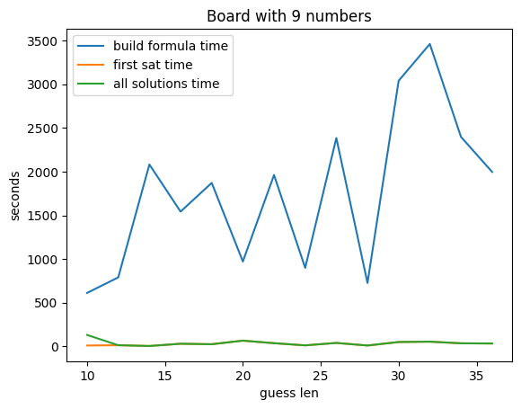

# Report

## CDCL - exercise 1

## Encoding - exercise 2

### variables
Let $n$ be the length of the secret code and the guesses on the board.

for $i \in \{0, 1,..., 9\}$ and $k \in \{1, 2,..., n\}$, we define the propositional symbols

$p_{ik}$ - entry at position $k$ has number $i$

### constraints

#### Each position must have at least 1 number

$\bigvee_{i = 0}^{9} \bigvee_{k=1}^{n} p_{ik}$ 

#### Each position must have at most 1 number

$\bigwedge_{k=1}^{n} \bigwedge_{i = 0}^{8} \bigwedge_{j = i+1}^{9} (\neg p_{ik} \vee \neg p_{jk})$ 

#### Almost Mastermind - exercise 2.1

if there were no black pegs, we negate the numbers at the current guess's position
let $a_i$ be the number at the position $i$ of a given guess, where $i = 1, ..., n$

$\bigwedge_{k=1}^{n} \neg p_{a_{i}k}$

Else, let $b$ be the number of black pegs. We need to consider all possible groups of $b$ size, without repetition.
We get a total of $B = \frac{n!}{b!(n-b)!}$ sets of $b$ size. These sets have, at most, $n$ elements, if $b = n$
Each of these sets will contain the possible positions with the correct numbers.
let $P_{l}$ be such a set, with $l = 1, ..., b$ and $NP_{l}$ the complement of $P_{l}$. e.g. if $n = 4$, $b=3$ and $P_{1} = \{1, 2, 3\}$, 
then $NP_{1} = \{4\}$

$\bigvee_{l=1}^{B} \bigwedge_{\substack{  p \in P_{l}  \\ q \in NP_{l}} } p_{a_{p}p} \wedge \neg p_{a_{q}q}$

#### Full Mastermind - exercise 2.2

Let $w$ be the number of white pegs for a given guess. 
For each combination (i.e. the set $P_{l}$ with the positions we consider to have the correct number),
the number of sets that contain the possible white positions on the guess 

$W = \frac{(n-b)!}{w!((n-b)-w)!}$

This is because there's no need to consider positions that we are assuming to be correct for the current combination (stored in $P_{l}$)

Like, ....

### graphs

#### increasing guess number

We tested independentely two variables, number of guesses and size of a guess (which we call board len)

Increasing the number of guesses increases the formula building time somewhat linearly. the spikes in time are, as expected, related to the bigger porpotion of white pegs in relation to black pegs

We see the same pattern for boards with len of 9, but for the same number of guesses, each building is much much bigger

If we now increase the len of boards, but with the same guess number, we see a sharp rise in the time it takes to construct a formula

This is because we consider all permutations for possible places for the white pegs, for each combination of black pegs. This corresponds to the complexity of our encoding being factorial.

